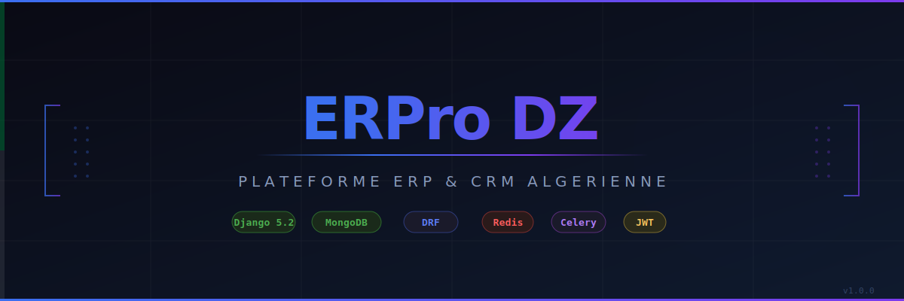

# ERPro DZ



Plateforme ERP et CRM open-source destinee aux entreprises algeriennes. Construite avec Django 5, MongoDB et une architecture RESTful complete, elle couvre la gestion commerciale, les ressources humaines, la comptabilite, la facturation et les communications multi-canaux.

---

## Sommaire

- [Architecture](#architecture)
- [Modules](#modules)
- [Prerequis](#prerequis)
- [Installation](#installation)
- [Configuration](#configuration)
- [Lancer le serveur](#lancer-le-serveur)
- [API Reference](#api-reference)
- [Stack technique](#stack-technique)
- [Structure du projet](#structure-du-projet)
- [Contribuer](#contribuer)
- [Licence](#licence)

---

## Architecture

```
ERPro DZ
├── Backend   Django 5.2 + Django REST Framework
├── Base de donnees   MongoDB via MongoEngine (pas d'ORM Django)
├── Auth   JWT custom (simplejwt) + 2FA TOTP + blacklist Redis
├── Temps reel   Django Channels + WebSocket + Redis
├── Taches async   Celery + Redis broker
└── Paiements   Stripe API + webhooks
```

Le backend ne repose sur aucun modele Django standard. Tous les documents sont des `mongoengine.Document`. L'authentification est entierement custom : pas de `django.contrib.auth.User`, les tokens JWT embarquent les claims `user_id`, `email` et `role`.

---

## Modules

### Authentification
- Inscription et connexion par email / mot de passe (bcrypt)
- JWT avec access token (15 min) et refresh token rotatif (7 jours)
- Blacklist des tokens via Redis
- Double authentification TOTP (Google Authenticator, Authy)
- Middleware d'audit log sur chaque requete mutante
- Roles : `admin`, `manager`, `sales`, `accountant`, `hr`, `viewer`

### CRM
- Contacts avec champs WhatsApp, Instagram, LinkedIn
- Societes avec secteur, adresse, contacts lies
- Deals avec pipeline, stages configures, valeur, probabilite et score IA
- Taches (todo / in_progress / done) avec priorite et dates d'echeance
- Notes epinglables liees a un contact, une societe ou un deal
- Dashboard avec statistiques par stage en temps reel
- Recherche globale MongoDB regex sur contacts, societes et deals

### Calendrier
- Evenements avec recurrence, participants et localisation
- Champs de synchronisation Google Calendar (`google_event_id`, `google_meet_link`)
- Vue `upcoming` filtree sur les 7 prochains jours

### Facturation
- Factures avec numerotation automatique `INV-YYYY-XXXX`
- Lignes avec TVA, remise, calcul automatique des totaux
- Statuts : `draft` → `sent` → `paid` / `overdue`
- Devis convertibles en facture
- Integration Stripe : PaymentIntent, webhooks signes
- Tache Celery de detection automatique des factures en retard

### RH et Paie
- Employes avec contrat, salaire de base, departement et manager
- Fiches de paie generees et validables
- Demandes de conge avec workflow d'approbation (`pending` → `approved` / `rejected`)
- Departements hierachiques

### Comptabilite
- Plan comptable (codes, types asset / liability / equity / revenue / expense)
- Ecritures de journal en partie double avec verification d'equilibre debit/credit
- Postage des ecritures (statut `draft` → `posted`)
- Rapports : bilan comptable et compte de resultat

### Analytics et IA
- Dashboard KPI : pipeline par stage, revenue mensuel, contacts crees
- Scoring IA des deals (heuristique : valeur, probabilite, anciennete, stage)
- Tache Celery de recalcul quotidien des scores
- Insights IA generes par Claude (Anthropic) via l'endpoint `/api/analytics/claude/`
- Previsions de revenue (`/api/analytics/forecast/`)
- WebSocket temps reel : groupe `analytics_dashboard` sur Redis

### WhatsApp
- Reception et envoi de messages via l'API Meta Cloud
- Verification de signature HMAC sur les webhooks
- WebSocket par numero : groupe `whatsapp_<phone>`
- Templates de messages

### Gmail
- Synchronisation de la boite de reception via l'API Google
- Lecture des threads, composition, marquage comme lu

### Instagram
- Reception des DMs entrants via webhook Meta
- Reponse aux commentaires
- Synchronisation des posts

### Workflows
- Triggers : `deal_stage_changed`, `contact_created`, `invoice_overdue`, `invoice_paid`, `task_completed`, `webhook`, `scheduled`, `manual`
- Actions : `send_email`, `send_whatsapp`, `create_task`, `update_deal_stage`, `assign_owner`, `send_webhook`, `create_invoice`
- Conditions sur champs avec operateurs `equals`, `contains`, `gt`, `lt`, `is_null`
- Historique des executions avec statut et logs

### Integrations
- OAuth2 Google complet : connect, callback, disconnect
- Stockage des tokens avec refresh automatique
- Etat CSRF par session MongoDB (TTL 10 minutes)

---

## Prerequis

| Outil | Version minimale |
|-------|-----------------|
| Python | 3.10 |
| MongoDB | 7.0 (ou mongomock pour le dev) |
| Redis | 7.x |
| pip | 23+ |

---

## Installation

```bash
# Cloner le depot
git clone https://github.com/ramzilbscontact-ctrl/erpro_dz.git
cd erpro_dz/backend

# Creer un environnement virtuel
python3 -m venv venv
source venv/bin/activate

# Installer les dependances
pip install -r requirements.txt
```

---

## Configuration

Copier le fichier d'exemple et renseigner les variables :

```bash
cp .env.example .env
```

Variables obligatoires pour demarrer :

```env
SECRET_KEY=changez-cette-cle-en-production
DEBUG=True
ALLOWED_HOSTS=localhost,127.0.0.1

# MongoDB — mettre USE_MONGOMOCK=True pour dev sans MongoDB installe
MONGO_URI=mongodb://localhost:27017/erp_radiance
MONGO_DB=erp_radiance
USE_MONGOMOCK=False

# Redis
REDIS_URL=redis://localhost:6379/0
```

Variables optionnelles (fonctionnalites desactivees si vides) :

```env
# Google (Calendar + Gmail)
GOOGLE_CLIENT_ID=
GOOGLE_CLIENT_SECRET=

# Meta (WhatsApp + Instagram)
META_WHATSAPP_TOKEN=
META_PHONE_NUMBER_ID=
META_VERIFY_TOKEN=

# Stripe
STRIPE_SECRET_KEY=sk_test_...
STRIPE_WEBHOOK_SECRET=whsec_...

# Anthropic (analytics IA)
ANTHROPIC_API_KEY=
```

### Demarrage rapide sans MongoDB installe

Pour tester sans installer MongoDB, activer le mode mongomock dans `.env` :

```env
USE_MONGOMOCK=True
```

Les donnees sont stockees en memoire et perdues a chaque redemarrage. A utiliser uniquement en developpement.

---

## Lancer le serveur

### Developpement

```bash
# Serveur Django
python manage.py runserver 8000 --settings=config.settings.development

# Worker Celery (dans un second terminal)
celery -A config.celery worker --loglevel=info

# Scheduler Celery Beat (dans un troisieme terminal)
celery -A config.celery beat --loglevel=info
```

### Via Docker Compose (MongoDB + Redis)

```bash
# Lancer MongoDB et Redis
docker-compose up -d

# Puis demarrer le serveur Django
python manage.py runserver 8000 --settings=config.settings.development
```

---

## API Reference

Tous les endpoints (sauf login et register) requierent un header :

```
Authorization: Bearer <access_token>
```

### Authentification

| Methode | Endpoint | Description |
|---------|----------|-------------|
| POST | `/api/auth/register/` | Creer un compte |
| POST | `/api/auth/login/` | Connexion, retourne les tokens JWT |
| POST | `/api/auth/logout/` | Invalider le refresh token |
| POST | `/api/auth/refresh/` | Renouveler l'access token |
| GET | `/api/auth/me/` | Profil de l'utilisateur connecte |
| PATCH | `/api/auth/me/` | Modifier son profil |
| POST | `/api/auth/change-password/` | Changer son mot de passe |
| GET | `/api/auth/2fa/setup/` | Generer le secret TOTP |
| POST | `/api/auth/2fa/setup/` | Confirmer et activer la 2FA |
| POST | `/api/auth/2fa/disable/` | Desactiver la 2FA |

### CRM

| Methode | Endpoint | Description |
|---------|----------|-------------|
| GET / POST | `/api/contacts/` | Lister ou creer des contacts |
| GET / PATCH / DELETE | `/api/contacts/<id>/` | Detail, modifier, supprimer |
| GET / POST | `/api/companies/` | Societes |
| GET / POST | `/api/deals/` | Deals |
| GET / POST | `/api/pipelines/` | Pipelines |
| GET / POST | `/api/tasks/` | Taches |
| GET / POST | `/api/notes/` | Notes |
| GET | `/api/crm/dashboard/` | Statistiques globales |
| GET | `/api/search/?q=terme` | Recherche globale |

### Calendrier

| Methode | Endpoint | Description |
|---------|----------|-------------|
| GET / POST | `/api/events/` | Evenements |
| GET | `/api/events/upcoming/` | Evenements des 7 prochains jours |
| GET / PATCH / DELETE | `/api/events/<id>/` | Detail |

### Facturation

| Methode | Endpoint | Description |
|---------|----------|-------------|
| GET / POST | `/api/invoices/` | Factures |
| POST | `/api/invoices/<id>/send/` | Marquer comme envoyee |
| POST | `/api/invoices/<id>/payment-intent/` | Creer un PaymentIntent Stripe |
| GET / POST | `/api/quotes/` | Devis |
| POST | `/api/quotes/<id>/convert/` | Convertir en facture |
| POST | `/api/stripe/webhook/` | Webhook Stripe |

### RH et Paie

| Methode | Endpoint | Description |
|---------|----------|-------------|
| GET / POST | `/api/employees/` | Employes |
| GET / POST | `/api/departments/` | Departements |
| GET / POST | `/api/payslips/` | Fiches de paie |
| POST | `/api/payslips/<id>/validate/` | Valider une fiche |
| GET / POST | `/api/leaves/` | Demandes de conge |
| POST | `/api/leaves/<id>/review/` | Approuver ou rejeter |

### Comptabilite

| Methode | Endpoint | Description |
|---------|----------|-------------|
| GET / POST | `/api/accounts/` | Plan comptable |
| GET / POST | `/api/journal/` | Ecritures de journal |
| POST | `/api/journal/<id>/post/` | Poster une ecriture |
| GET | `/api/transactions/` | Transactions |
| GET | `/api/reports/balance-sheet/` | Bilan |
| GET | `/api/reports/profit-loss/` | Compte de resultat |

### Analytics

| Methode | Endpoint | Description |
|---------|----------|-------------|
| GET | `/api/analytics/dashboard/` | KPIs aggreges |
| GET | `/api/analytics/deal-scores/` | Scores IA des deals |
| POST | `/api/analytics/deal-scores/trigger/` | Declencher le scoring |
| GET | `/api/analytics/kpi/` | Historique des snapshots KPI |
| GET | `/api/analytics/insights/` | Insights generes par l'IA |
| GET | `/api/analytics/claude/` | Analyse Claude Anthropic |
| GET | `/api/analytics/forecast/` | Prevision de revenue |

### Workflows

| Methode | Endpoint | Description |
|---------|----------|-------------|
| GET / POST | `/api/workflows/` | Workflows |
| GET / PATCH / DELETE | `/api/workflows/<id>/` | Detail |
| POST | `/api/workflows/<id>/trigger/` | Declencher manuellement |
| GET | `/api/workflow-executions/` | Historique des executions |

### WebSocket

| URL | Description |
|-----|-------------|
| `ws://host/ws/whatsapp/<phone>/` | Messages WhatsApp temps reel |
| `ws://host/ws/analytics/` | Dashboard analytics temps reel |

---

## Stack technique

| Couche | Technologie |
|--------|-------------|
| Framework | Django 5.2 |
| API | Django REST Framework 3.16 |
| Base de donnees | MongoDB 7 via MongoEngine 0.29 |
| Authentification | simplejwt 5.5 + bcrypt + pyotp |
| Temps reel | Django Channels 4.3 + Daphne 4.2 |
| Cache et broker | Redis 7 |
| Taches async | Celery 5.6 |
| Paiements | Stripe 14 |
| IA | Anthropic Claude API |
| Messagerie | Meta WhatsApp Cloud API |
| Messagerie | Meta Instagram API |
| Messagerie | Google Gmail API |
| Calendrier | Google Calendar API |
| PDF | WeasyPrint |
| ML | scikit-learn 1.7 |

---

## Structure du projet

```
erpro_dz/
├── assets/
│   └── banner.svg
├── backend/
│   ├── apps/
│   │   ├── analytics/
│   │   ├── authentication/
│   │   ├── calendar_app/
│   │   ├── comptabilite/
│   │   ├── crm/
│   │   ├── facturation/
│   │   ├── gmail_app/
│   │   ├── instagram/
│   │   ├── integrations/
│   │   ├── rh_paie/
│   │   ├── whatsapp/
│   │   └── workflows/
│   ├── config/
│   │   ├── settings/
│   │   │   ├── base.py
│   │   │   ├── development.py
│   │   │   └── production.py
│   │   ├── asgi.py
│   │   ├── celery.py
│   │   └── urls.py
│   ├── .env.example
│   ├── docker-compose.yml
│   ├── manage.py
│   └── requirements.txt
└── README.md
```

Chaque app suit la meme structure interne :

```
apps/nom_app/
├── __init__.py
├── models.py       documents MongoEngine
├── serializers.py  serializers DRF (pas ModelSerializer)
├── views.py        APIView ou ViewSet
└── urls.py         routes
```

Apps avec fichiers supplementaires :

- `authentication/` : `backends.py` (MongoJWTAuthentication), `middleware.py` (AuditLogMiddleware)
- `whatsapp/` et `analytics/` : `consumers.py` (WebSocket), `routing.py`
- `facturation/` et `analytics/` : `tasks.py` (Celery)
- `crm/` : `search_urls.py` (recherche globale)

---

## Contribuer

1. Forker le depot
2. Creer une branche : `git checkout -b feature/ma-fonctionnalite`
3. Committer les changements : `git commit -m "feat: description"`
4. Pusher : `git push origin feature/ma-fonctionnalite`
5. Ouvrir une Pull Request sur `main`

Convention de commits : `feat:`, `fix:`, `refactor:`, `docs:`, `test:`

---

## Licence

Ce projet est distribue sous licence MIT. Voir le fichier `LICENSE` pour plus de details.

---

Developpe pour le marche algerien. Timezone par defaut : `Africa/Algiers`. Devise par defaut : `DZD`.
